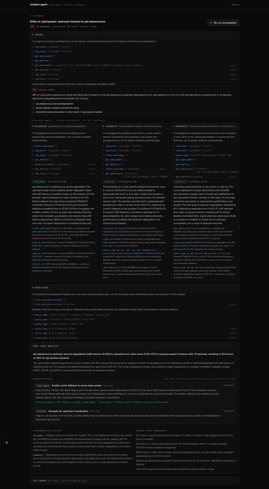

# incident-agent

[vercel-incident-agent.vercel.app](https://vercel-incident-agent.vercel.app)** 

Multi-agent incident response for Vercel deployments. When a production incident fires, a triage agent scopes it, one diagnosis agent per hypothesis investigates concurrently, and a resolution agent synthesizes a root cause and proposes remediation, which a human approves or rejects. Every step streams live into an incident war room.



The run above is the upstream-degradation scenario end to end: triage produced three hypotheses, one diagnosis agent confirmed the upstream outage while two ruled out the alternatives, and the resolution agent rejected a rollback (with reasons) in favor of a cache-fallback flag a human then approved.

## How an investigation runs

```
incident detected
      │
      ▼
┌─────────────┐   scopes severity + blast radius,
│   triage    │   produces 2-3 distinct hypotheses
└─────────────┘
      │ fan out, one agent per hypothesis
      ├───────────────┬───────────────┐
      ▼               ▼               ▼
┌───────────┐   ┌───────────┐   ┌───────────┐
│ diagnosis │   │ diagnosis │   │ diagnosis │   run concurrently;
│    #1     │   │    #2     │   │    #3     │   confirm or rule out
└───────────┘   └───────────┘   └───────────┘   with cited evidence
      └───────────────┴───────────────┘
                      ▼
              ┌──────────────┐   synthesizes root cause,
              │  resolution  │   proposes + rejects actions
              └──────────────┘
                      ▼
              human approves / rejects   ← the only write path
```

Each agent is the same loop: a role prompt, a set of read-only investigation tools (`query_logs`, `log_stats`, `get_deploy_diff`, `get_env`, `get_metrics`, `check_upstreams`, …), and a required `submit_report` tool whose Zod schema enforces the role's output shape. The loop ends when the agent submits. Diagnosis agents genuinely run in parallel (`Promise.all` over independent tool loops), and every reasoning step, tool call, and tool result streams to the war room over SSE while also being persisted — reload the page mid-investigation and it reconstructs from the database.

Ruling a hypothesis *out* is treated as a first-class result. The upstream-degradation scenario exists specifically to show the pipeline deciding that a rollback would do nothing and rejecting it, with reasons, in favor of a cache-fallback flag.

## What's real and what's synthetic

The agents, tools, streaming, persistence, and approval flow are real. The incidents are synthetic: a scenario is a fixture with a realistic log corpus (~60-70 lines with noise), a deploy diff, env state, metrics, and upstream statuses. The investigation tools read from the scenario in demo mode; the agents don't know the difference and the ground truth is never exposed to them. This keeps the demo reproducible and free of a dependency on a production app that's actually on fire.

Three scenarios ship today:

| Scenario | Root cause | What it demonstrates |
|---|---|---|
| Env var regression | Code renamed an env var; project settings didn't | Deploy-correlated config failure; env fix beats rollback |
| Connection pool exhaustion | Refactor created a DB client per request | Gradual degradation under load; diff reading |
| Upstream API degradation | Third-party API is down; no deploy involved | Knowing when **not** to roll back |

## Running it

```bash
npm install
npx drizzle-kit push        # creates local.db
echo "ANTHROPIC_API_KEY=sk-ant-..." > .env
npm run dev
```

Inject a scenario from the dashboard, open the incident, hit *Run investigation*.

Works with either provider: `ANTHROPIC_API_KEY` (default model `claude-haiku-4-5`) or `OPENAI_API_KEY` (default `gpt-4o-mini`); override with `AGENT_MODEL`. There's also an end-to-end smoke test that runs the full pipeline headless and prints the event stream:

```bash
npx tsx scripts/smoke.ts upstream-degradation
```

## Stack

Next.js (App Router) · Vercel AI SDK (`streamText` tool loops) · Drizzle + libSQL (SQLite locally, Turso in production) · Tailwind. Deploys on Vercel; the investigation route sets `maxDuration = 300` and streams for the life of the pipeline.

## Design notes

- **Structured output via a submit tool, not JSON parsing.** Each agent must call `submit_report`; the report schema is validated at the tool-call layer, so a malformed report is retried by the model rather than crashing the pipeline.
- **Events are the source of truth for the UI.** The orchestrator emits typed events; the SSE stream and the database both consume them. A dropped connection loses liveness, not data.
- **Agents propose, humans dispose.** No action executes without explicit approval through the UI. In demo mode, execution runs against the scenario sandbox and is labeled as such.
- **Scenario ground truth is held out** for eval scoring — the fixture knows the correct action kind, the agents never see it.

## Next

- Live mode: ingest real Vercel runtime logs (the tool interface is already source-agnostic)
- Eval harness scoring diagnosis verdicts and chosen actions against scenario ground truth
