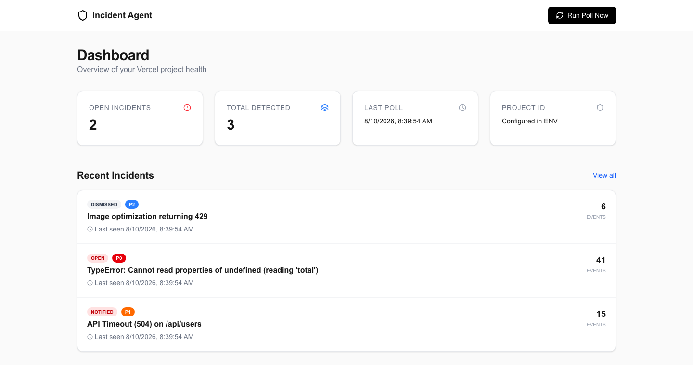
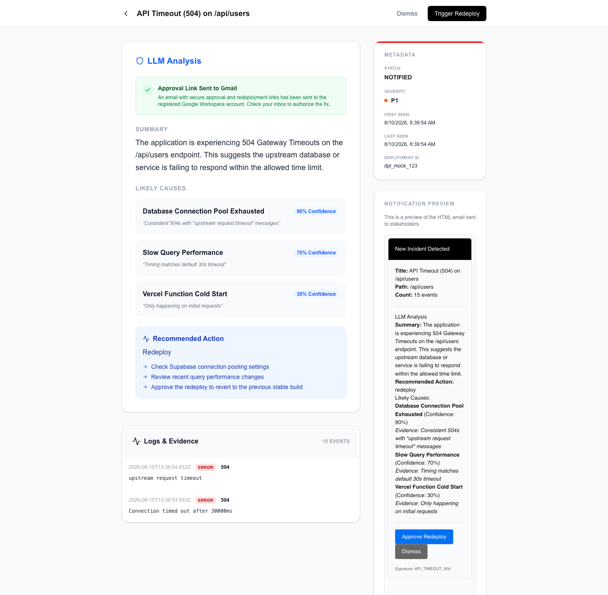
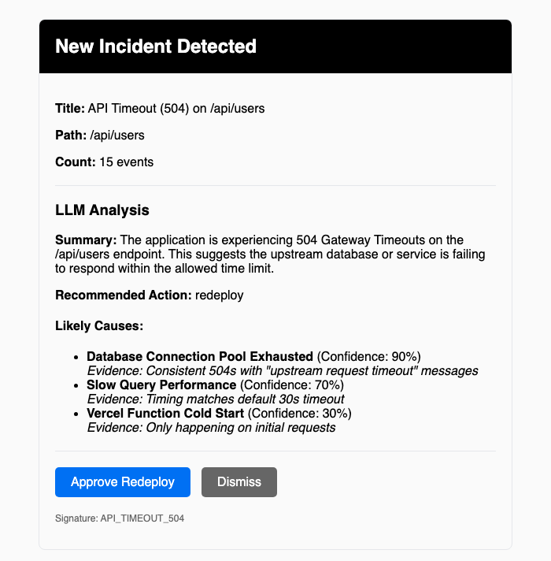

# Vercel Incident Agent

An autonomous DevOps agent that monitors Vercel deployments, analyzes runtime errors using AI, and facilitates one-click fixes via secure email loops. This is my first project utilizing Claude code for a language I'm not familiar with. This is my attempt to learn TypeScript while vibecoding ;) ---Enjoy!

## Overview

This project solves the "on-call" problem for solo developers. Instead of manually digging through logs when things break, this agent acts as a always-on SRE team member. It detects critical issues in real-time, diagnoses them using LLMs, and presents you with a clear solution.

### Key Features

*   **Autopilot Monitoring**: Polls Vercel runtime logs for 500-level errors on a cron schedule.
*   **Intelligent De-duplication**: Groups thousands of log lines into distinct "Incidents" based on error signatures.
*   **AI Root Cause Analysis**: Uses GPT-4o-mini to analyze stack traces and suggest specific fixes (e.g., "Increase DB connection limit").
*   **Human-in-the-Loop**: Sends a formatted email with a "Redeploy" button. No need to open the Vercel dashboard.
*   **Secure Actions**: Email links use hashed, single-use tokens to trigger API actions safely.

## What It Looks Like

The dashboard after a poll — open count, and the incidents the de-duplication
grouped out of the raw log lines:



Opening one shows the LLM analysis (summary, ranked likely causes with
confidence, recommended next steps), the log lines that triggered it, and the
approve/dismiss buttons:



That same analysis goes out as the alert email. The two buttons are the
single-use token links — clicking Approve triggers the redeploy without opening
Vercel:



These are from seeded fixture data, not a live outage: run `node seed-incident.js`
after `prisma db push` and you get the same three incidents locally, no Vercel
token or LLM key needed.

## Architecture

1.  **Ingestion**: A Next.js API route (`/api/cron/poll-logs`) fetches recent logs from Vercel.
2.  **Processing**: Logs are structured, hashed, and stored in a SQLite database via Prisma.
3.  **Analysis**: New incidents trigger an LLM analysis job.
4.  **Notification**: The system generates an HTML report and emails it via Gmail API.
5.  **Resolution**: The developer clicks a link to approve the fix, triggering a Vercel redeploy via API.

## Tech Stack

*   **Core**: Next.js 14 (App Router), TypeScript
*   **Database**: SQLite + Prisma ORM
*   **AI**: OpenAI API
*   **Integrations**: Vercel SDK, Googleapis (Gmail)
*   **UI**: Tailwind CSS, Lucide Icons

## Setup

1.  **Clone & Install**:
    ```bash
    git clone https://github.com/tayden-b/vercel-incident-agent.git
    cd vercel-incident-agent
    npm install
    ```

2.  **Environment Variables**:
    Copy `.env.example` to `.env` and fill in your keys:
    *   `VERCEL_TOKEN` & `VERCEL_PROJECT_ID`: For log access.
    *   `LLM_API_KEY`: OpenAI key.
    *   `GMAIL_CLIENT_ID` etc.: For sending emails (optional, console logs used as fallback).
    *   `SLACK_WEBHOOK_URL`: An incoming-webhook URL to also post alerts to Slack (optional, no OAuth needed). Set either or both channels; unset channels are skipped and logged to the console.

3.  **Set Up the Database**:
    The SQLite database is not committed. Create it from the Prisma schema:
    ```bash
    npx prisma db push
    ```
    This writes `prisma/dev.db` locally. Re-run it after any schema change.
    To see the UI with data before you have a real incident, seed the fixtures:
    ```bash
    node seed-incident.js
    ```
    It wipes the incident tables and inserts the three incidents shown above.

4.  **Run Locally**:
    ```bash
    npm run dev
    ```
    The cron job can be triggered manually at `http://localhost:3000/api/cron/poll-logs`.

## Database

This project uses a local SQLite database for simplicity. The `.db` file is
gitignored, so each clone starts from `prisma db push`.
*   `npx prisma db push`: Create the database / sync schema changes.
*   `npx prisma studio`: View the data.

## License

MIT
